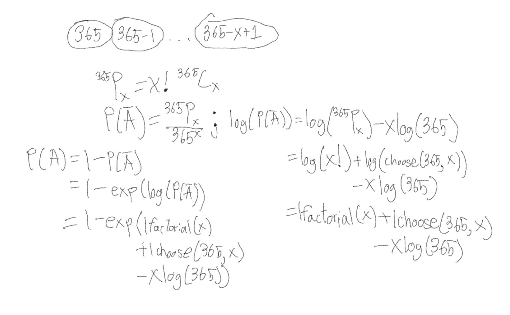

```{r, include = FALSE}
knitr::opts_chunk$set(
  collapse = TRUE,
  comment = "#>"
)
```

```{r setup}
# Imports my package (Name: Thomas Hernandez)
library(MATH4753F25thomas)
```


## 1. Mathematical Derivation

The birthday problem shows the probability that in a population of $x$ people, where at least two of those people share the same birthday.

*Note:* We are using $x$ instead of $n$ because Dr. Wayne Stewart mentioned to use $x$.

We are going to first let $P(A)$ be the probability that at least two people share a birthday, and let $P(\bar{A})$ be the probability that everyone in the population has unique birthdays.

$P(\bar{A})$ can be calculated as follows:

$$P(\bar{A}) = \frac{365}{365^x} \times \frac{365-1}{365^x} \times \cdots \times \frac{365-x+1}{365^x}$$

To rewrite $P(\bar{A})$ in a more compact form, we must know where the formula for this problem comes from:

$$^{365}P_{x}=x!^{365}C_{x}$$

We can now rewrite $P(\bar{A})$ in its more compact form:

$$P(\bar{A})=\frac{^{365}P_{x}}{365^{x}}$$

To make $P(\bar{A})$ more simplistic for the average reader, we can use the following form:

$$P(\bar{A}) = \frac{365!}{(365-x)! \cdot 365^x}$$

We can also rewrite $P(\bar{A})$ as the following as a logarithm:

$$\log(P(\bar{A}))=\log(^{365}P_{x})-x\log(365)$$

From there, $\log(P(\bar{A}))$ can be expanded into the following:

$$\log(P(\bar{A}))=\log(x!)+x\log( {365\choose{x}} )-x\log(365)$$

Now, we can visualize what $P(A)$ represents:

$$P(A) = 1 - P(\bar{A}) = 1 - \frac{365!}{(365-x)! \cdot 365^x}$$

This form of $P(A)$ represents the probability that at least two people share a birthday.

## 2. Reformulation using lfactorial() and lchoose()

The reformulation of the probability that a population of $x$ people who share the same birthday using `lfactorial()` and `lchoose()` is shown below (the original was made by Dr. Stewart, recreated by Thomas Hernandez):

<center>
{ width=80% }
</center>


## 3. The Birthday Function

This is what the birthday function contains inside the body:

```{r}
birthday=function(x){
  1 - exp(lchoose(365,x) + lfactorial(x) - x*log(365))
}
```

## 4. Example of the Birthday Function

This is an example of how the birthday function is used:

```{r}
birthday(x=20:25)
```
